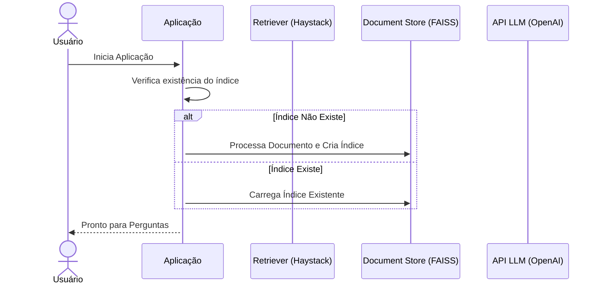
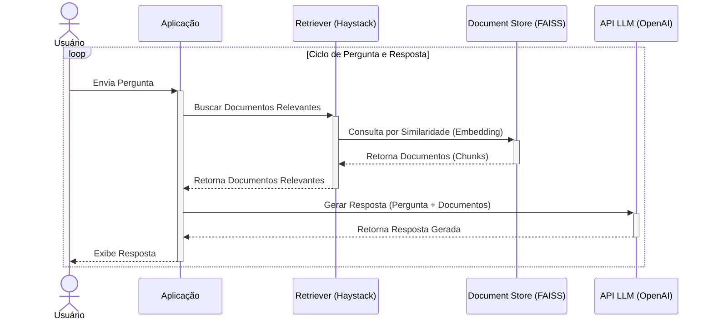

# PoC RAG com Haystack, FAISS e LLMs

Este projeto é uma Prova de Conceito (PoC) que demonstra a implementação de um pipeline de Retrieval-Augmented Generation (RAG) utilizando a biblioteca Haystack. Ele permite fazer perguntas sobre um documento de texto (`.txt` ou `.md`) e obter respostas geradas por um Modelo de Linguagem Grande (LLM) como GPT-4o Mini (OpenAI), Claude ou Gemini, com base no conteúdo do documento fornecido.

## Pré-requisitos

| Ferramenta | Versão recomendada | Observação |
|------------|-------------------|------------|
| **Python** | **3.11.x**        | Versões 3.12+ ainda não têm wheels estáveis para *sentencepiece* (dependência de `sentence-transformers`) e exigem toolchain C/C++; use 3.11 para instalar sem problemas. |
| **pip**    | ≥ 23              | `python -m pip install -U pip` |
| **Git**    | Qualquer          | Opcional, apenas para clonar o repositório. |

> 💡 Se precisar manter Python ≥ 3.12, instale **Visual C++ Build Tools**, **CMake** e rode  
> `pip install --no-binary sentencepiece sentencepiece` antes de `requirements.txt`.  
> A PoC foi testada em Windows 10/11 e Linux (Ubuntu 22.04) com Python 3.11.

---

## Como Usar

1. **Crie e ative um ambiente virtual (recomendado):**

   *bash*
   ```bash
   python -m venv .venv
   source .venv/bin/activate
   ```
   *powershell*
   ```powershell
   py -3.11 -m venv .venv
   .venv\Scripts\Activate.ps1
   ```

2. **Instale as dependências:**
   ```bash
   python -m pip install -U pip            # garante o pip atualizado
   pip install -r requirements.txt         # instala Haystack, FAISS, etc.
   ```
   > Se surgir erro com *sentencepiece* em Python ≥ 3.12, veja a nota em **Pré-requisitos**.

3. **Configure suas chaves de API** para o(s) provedor(es) desejado(s):
   ```powershell
   # exemplo em PowerShell (substitua pelas suas chaves)
   $Env:OPENAI_API_KEY = "sk-..."
   $Env:CLAUDE_API_KEY = "claude-..."
   $Env:GEMINI_API_KEY = "gemini-..."
   ```
   Defina apenas a(s) variável(is) que for utilizar.

---

## Como Executar

```bash
python rag.py --provider [openai|claude|gemini] --doc_path ks.txt
```

| Flag         | Descrição                                                                                             |
|--------------|--------------------------------------------------------------------------------------------------------|
| `--provider` | Provedor de LLM a usar (`openai`, `claude` ou `gemini`).                                               |
| `--doc_path` | Caminho para o arquivo `.txt` ou `.md` que contém o conteúdo base.                                     |

**Exemplo**
```bash
python rag.py --provider openai --doc_path conhecimento_base.md
```

A primeira execução cria o índice FAISS; as seguintes reutilizam-no e iniciam mais rápido. Digite suas perguntas no terminal e `sair` para encerrar.

---

## Fluxo de Funcionamento

A aplicação segue um fluxo RAG padrão orquestrado pelo Haystack:

1.  **Inicialização:**
    *   Ao executar o script pela primeira vez com um novo documento, ele lê o arquivo (`.txt` ou `.md`).
    *   Divide o texto em pedaços menores (chunks).
    *   Utiliza um modelo de embedding (`sentence-transformers/all-MiniLM-L6-v2`) para converter cada chunk em um vetor numérico (embedding).
    *   Armazena esses embeddings em um índice vetorial FAISS (`faiss_index/faiss_index.faiss` e `faiss_index.json`) e o texto original dos chunks em um banco de dados SQLite (`faiss_document_store.db`) gerenciados pelo `FAISSDocumentStore`.
    *   Se o índice já existir, ele é carregado diretamente, pulando a etapa de processamento do documento.

2.  **Ciclo de Pergunta e Resposta:**
    *   **Usuário:** Envia uma pergunta.
    *   **ConversationTracker:** Recupera o histórico recente da conversa (se houver).
    *   **Aplicação:** Combina o histórico com a pergunta atual.
    *   **Retriever (`EmbeddingRetriever`):**
        *   Converte a pergunta combinada (com histórico) em um embedding usando o mesmo modelo (`all-MiniLM-L6-v2`).
        *   Consulta o `FAISSDocumentStore` para encontrar os embeddings de chunks mais similares ao embedding da pergunta (usando FAISS internamente).
        *   Retorna os chunks de texto correspondentes mais relevantes.
    *   **PromptNode:**
        *   Recebe a pergunta original, o histórico e os chunks relevantes recuperados.
        *   Formata um prompt final usando um template pré-definido, instruindo o LLM a responder com base no contexto fornecido (os chunks) e no histórico.
        *   Envia o prompt formatado para a API do LLM selecionado (OpenAI, Claude ou Gemini).
    *   **LLM API:** Processa o prompt e gera a resposta.
    *   **PromptNode:** Recebe a resposta do LLM.
    *   **Aplicação:** Exibe a resposta ao usuário.
    *   **ConversationTracker:** Armazena a pergunta e a resposta atual no histórico da sessão.

3.  **Encerramento:** O ciclo se repete até que o usuário digite 'sair'.

### Diagrama de Sequência: Inicialização



### Diagrama de Sequência: Ciclo de Pergunta e Resposta



## Glossário de Termos

*   **RAG (Retrieval-Augmented Generation):** Arquitetura de IA que melhora as respostas de LLMs ao primeiro recuperar informações relevantes de uma base de conhecimento externa (seus documentos) e depois usar essas informações como contexto para gerar a resposta.
*   **Haystack:** Framework open-source em Python para construir pipelines de busca semântica e RAG. Fornece componentes como `DocumentStore`, `Retriever` e `PromptNode`.
*   **Pipeline:** No Haystack, uma sequência de componentes (nós) conectados que processam dados (ex: `Retriever` -> `PromptNode`).
*   **Document Store:** Componente do Haystack que armazena documentos e permite buscas eficientes.
*   **FAISS (Facebook AI Similarity Search):** Biblioteca otimizada para busca rápida de similaridade entre vetores de alta dimensão. Usada internamente pelo `FAISSDocumentStore`.
*   **FAISSDocumentStore:** Implementação específica do `DocumentStore` no Haystack que usa:
    *   **FAISS:** Para criar e consultar um índice vetorial dos embeddings dos documentos (arquivos `faiss_index.faiss` e `faiss_index.json`).
    *   **SQLite:** Para armazenar o texto original e metadados dos documentos (arquivo `faiss_document_store.db`).
*   **Embedding:** Representação numérica (vetor) do significado semântico de um texto. Textos similares possuem embeddings vetorialmente próximos.
*   **Embedding Model (`sentence-transformers/all-MiniLM-L6-v2`):** Modelo de machine learning pré-treinado que converte texto em embeddings (vetores de 384 dimensões neste caso).
*   **Retriever (`EmbeddingRetriever`):** Componente lógico do Haystack que atua como o "buscador inteligente". **Não é** o banco vetorial em si, nem o FAISS, nem o LLM. Sua função é:
    1.  Receber a pergunta do usuário (e histórico).
    2.  Usar o `Embedding Model` para converter a pergunta em um embedding.
    3.  Enviar esse embedding para o `FAISSDocumentStore`.
    4.  O `FAISSDocumentStore` utiliza o `FAISS` internamente para encontrar os embeddings de documentos mais similares.
    5.  Receber os documentos (chunks) correspondentes do `FAISSDocumentStore`.
    6.  Entregar esses documentos ao `PromptNode`.
*   **PromptNode:** Componente do Haystack que interage com um LLM. Ele pega a pergunta, os documentos recuperados pelo `Retriever` e o histórico, formata tudo usando um `Prompt Template`, e envia para a API do LLM (OpenAI, Claude, Gemini) para gerar a resposta final.
*   **Prompt Template:** Modelo de texto que define como as informações (contexto, histórico, pergunta) devem ser apresentadas ao LLM para guiá-lo na geração da resposta.
*   **LLM (Large Language Model):** Modelo de IA (ex: GPT-4o Mini, Claude, Gemini) treinado para entender e gerar linguagem natural. No RAG, ele gera a resposta final com base no prompt enriquecido pelo `PromptNode`.
*   **Chunks:** Pedaços menores em que o documento original é dividido para melhor processamento, embedding e recuperação.
*   **ConversationTracker:** Classe auxiliar neste script para manter um histórico das últimas interações (perguntas e respostas) e fornecer contexto conversacional ao LLM.