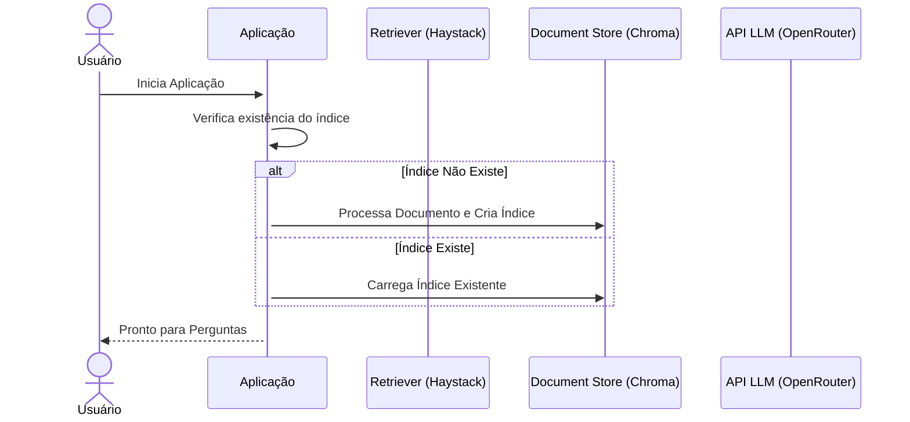
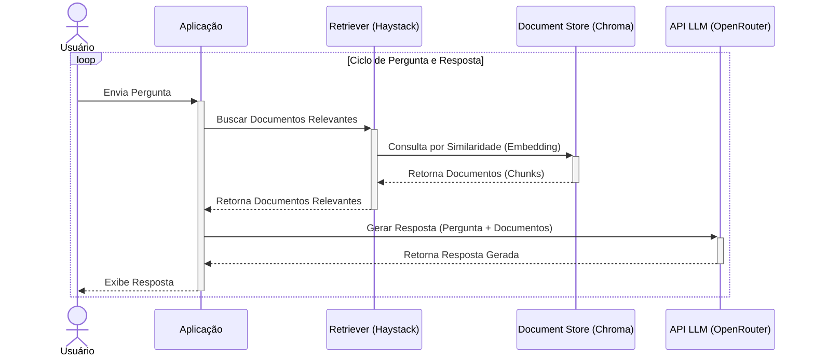

# PoC RAG com Haystack, Chroma e OpenRouter

Este projeto é uma Prova de Conceito (PoC) que demonstra a implementação de um pipeline de Retrieval-Augmented Generation (RAG) utilizando a biblioteca Haystack. Ele permite fazer perguntas sobre um documento de texto (`.txt` ou `.md`) e obter respostas geradas por um Modelo de Linguagem Grande (LLM) via OpenRouter, com base no conteúdo do documento fornecido.

## Pré-requisitos

| Ferramenta | Versão recomendada | Observação |
|------------|-------------------|------------|
| **Python** | **3.11.x**        | Versões 3.12+ ainda não têm wheels estáveis para *sentencepiece* (dependência de `sentence-transformers`) e exigem toolchain C/C++; use 3.11 para instalar sem problemas. |
| **pip**    | ≥ 23              | `python -m pip install -U pip` |
| **Git**    | Qualquer          | Opcional, apenas para clonar o repositório. |

> 💡 Se precisar manter Python ≥ 3.12, instale **Visual C++ Build Tools**, **CMake** e rode  
> `pip install --no-binary sentencepiece sentencepiece` antes de `requirements.txt`.  
> A PoC foi testada em Windows 10/11 e Linux (Ubuntu 22.04) com Python 3.11.

---

## Como Usar

1. **Crie e ative um ambiente virtual (recomendado):**

   *bash*
   ```bash
   python -m venv .venv
   source .venv/bin/activate
   ```
   *powershell*
   ```powershell
   py -3.11 -m venv .venv
   .venv\Scripts\Activate.ps1
   ```

2. **Instale as dependências:**
   ```bash
   python -m pip install -U pip            # garante o pip atualizado
   pip install -r requirements.txt         # instala Haystack, FAISS, etc.
   ```
   > Se surgir erro com *sentencepiece* em Python ≥ 3.12, veja a nota em **Pré-requisitos**.

3. **Configure sua chave de API OpenRouter:**

   Você pode definir a chave de API de três maneiras (em ordem de precedência):
   1.  **Argumento de linha de comando:** Passe `--openrouter-api-key "sk-..."` ao executar o script.
   2.  **Variável de ambiente:** Defina a variável de ambiente `OPENROUTER_API_KEY`.
   3.  **Entrada interativa:** Se a chave não for fornecida pelas opções acima, o script solicitará que você a insira no terminal.

   *Exemplo em PowerShell para variável de ambiente:*
   ```powershell
   $Env:OPENROUTER_API_KEY = "sk-or-v1-..."
   ```

---

## Como Executar

```bash
python rag.py --doc_path ks.txt --openrouter-api-key "sk-or-v1-..."
```

| Flag                  | Descrição                                                                                             |
|-----------------------|--------------------------------------------------------------------------------------------------------|
| `--doc_path`          | Caminho para o arquivo `.txt` ou `.md` que contém o conteúdo base.                                     |
| `--openrouter-api-key`| Sua chave de API OpenRouter (opcional). Se não fornecida, tenta variável de ambiente ou solicita interativamente. |

**Exemplo**
```bash
python rag.py --doc_path conhecimento_base.md --openrouter-api-key "sk-or-v1-..."
```

A primeira execução cria o índice Chroma; as seguintes reutilizam-no e iniciam mais rápido. Digite suas perguntas no terminal e `sair` para encerrar.

---

## Fluxo de Funcionamento

A aplicação segue um fluxo RAG padrão orquestrado pelo Haystack:

1.  **Inicialização:**
    *   Ao executar o script pela primeira vez com um novo documento, ele lê o arquivo (`.txt` ou `.md`).
    *   Divide o texto em pedaços menores (chunks).
    *   Utiliza um modelo de embedding (`sentence-transformers/all-MiniLM-L6-v2`) para converter cada chunk em um vetor numérico (embedding).
    *   Armazena esses embeddings em um `ChromaDocumentStore` persistente (`./chroma_db`).
    *   Se o índice já existir, ele é carregado diretamente, pulando a etapa de processamento do documento.

2.  **Ciclo de Pergunta e Resposta:**
    *   **Usuário:** Envia uma pergunta.
    *   **ConversationTracker:** Recupera o histórico recente da conversa (se houver).
    *   **Aplicação:** Combina o histórico com a pergunta atual.
    *   **Retriever (`ChromaEmbeddingRetriever`):**
        *   Converte a pergunta combinada (com histórico) em um embedding usando o mesmo modelo (`all-MiniLM-L6-v2`).
        *   Consulta o `ChromaDocumentStore` para encontrar os embeddings de chunks mais similares ao embedding da pergunta.
        *   Retorna os chunks de texto correspondentes mais relevantes.
    *   **ChatPromptBuilder:**
        *   Recebe a pergunta original, o histórico e os chunks relevantes recuperados.
        *   Formata um prompt final usando um template pré-definido, instruindo o LLM a responder com base no contexto fornecido (os chunks) e no histórico.
        *   Envia o prompt formatado para a API do LLM (OpenRouter).
    *   **LLM API:** Processa o prompt e gera a resposta.
    *   **Aplicação:** Exibe a resposta ao usuário.
    *   **ConversationTracker:** Armazena a pergunta e a resposta atual no histórico da sessão.

3.  **Encerramento:** O ciclo se repete até que o usuário digite 'sair'.

### Diagrama de Sequência: Ingestão / Inicialização


```mermaid
sequenceDiagram
    actor Usuário
    participant Aplicação as Aplicação
    participant Retriever as Retriever (Haystack)
    participant DB_Vetorial as Document Store (Chroma)
    participant LLM_API as API LLM (OpenRouter)

    Usuário->>+Aplicação: Inicia Aplicação
    Aplicação->>Aplicação: Verifica existência do índice
    alt Índice Não Existe
        Aplicação->>DB_Vetorial: Processa Documento e Cria Índice
    else Índice Existe
        Aplicação->>DB_Vetorial: Carrega Índice Existente
    end
    Aplicação-->>Usuário: Pronto para Perguntas
```

### Diagrama de Sequência: Ciclo de Pergunta e Resposta


```mermaid
sequenceDiagram
    actor Usuário
    participant Aplicação as Aplicação
    participant Retriever as Retriever (Haystack)
    participant DB_Vetorial as Document Store (Chroma)
    participant LLM_API as API LLM (OpenRouter)

    loop Ciclo de Pergunta e Resposta
        Usuário->>+Aplicação: Envia Pergunta
        Aplicação->>+Retriever: Buscar Documentos Relevantes
        Retriever->>+DB_Vetorial: Consulta por Similaridade (Embedding)
        DB_Vetorial-->>-Retriever: Retorna Documentos (Chunks)
        Retriever-->>-Aplicação: Retorna Documentos Relevantes
        Aplicação->>+LLM_API: Gerar Resposta (Pergunta + Documentos)
        LLM_API-->>-Aplicação: Retorna Resposta Gerada
        Aplicação-->>-Usuário: Exibe Resposta
    end
```

## Glossário de Termos

*   **RAG (Retrieval-Augmented Generation):** Arquitetura de IA que melhora as respostas de LLMs ao primeiro recuperar informações relevantes de uma base de conhecimento externa (seus documentos) e depois usar essas informações como contexto para gerar a resposta.
*   **Haystack:** Framework open-source em Python para construir pipelines de busca semântica e RAG. Fornece componentes como `DocumentStore`, `Retriever` e `ChatPromptBuilder`.
*   **Pipeline:** No Haystack, uma sequência de componentes (nós) conectados que processam dados (ex: `Retriever` -> `ChatPromptBuilder`).
*   **Document Store:** Componente do Haystack que armazena documentos e permite buscas eficientes.
*   **Chroma:** Banco de dados vetorial de código aberto que facilita o armazenamento e a busca de embeddings. Usado internamente pelo `ChromaDocumentStore`.
*   **ChromaDocumentStore:** Implementação específica do `DocumentStore` no Haystack que usa Chroma para armazenar e consultar embeddings e documentos.
*   **Embedding:** Representação numérica (vetor) do significado semântico de um texto. Textos similares possuem embeddings vetorialmente próximos.
*   **Embedding Model (`sentence-transformers/all-MiniLM-L6-v2`):** Modelo de machine learning pré-treinado que converte texto em embeddings (vetores de 384 dimensões neste caso).
*   **Retriever (`ChromaEmbeddingRetriever`):** Componente lógico do Haystack que atua como o "buscador inteligente". **Não é** o banco vetorial em si, nem o Chroma, nem o LLM. Sua função é:
    1.  Receber a pergunta do usuário (e histórico).
    2.  Usar o `Embedding Model` para converter a pergunta em um embedding.
    3.  Enviar esse embedding para o `ChromaDocumentStore`.
    4.  O `ChromaDocumentStore` utiliza o Chroma internamente para encontrar os embeddings de documentos mais similares.
    5.  Receber os documentos (chunks) correspondentes do `ChromaDocumentStore`.
    6.  Entregar esses documentos ao `ChatPromptBuilder`.
*   **ChatPromptBuilder:** Componente do Haystack que interage com um LLM. Ele pega a pergunta, os documentos recuperados pelo `Retriever` e o histórico, formata tudo usando um `Prompt Template`, e envia para a API do LLM (OpenRouter) para gerar a resposta final.
*   **Prompt Template:** Modelo de texto que define como as informações (contexto, histórico, pergunta) devem ser apresentadas ao LLM para guiá-lo na geração da resposta.
*   **LLM (Large Language Model):** Modelo de IA (ex: modelos OpenRouter) treinado para entender e gerar linguagem natural. No RAG, ele gera a resposta final com base no prompt enriquecido pelo `ChatPromptBuilder`.
*   **Chunks:** Pedaços menores em que o documento original é dividido para melhor processamento, embedding e recuperação.
*   **ConversationTracker:** Classe auxiliar neste script para manter um histórico das últimas interações (perguntas e respostas) e fornecer contexto conversacional ao LLM.